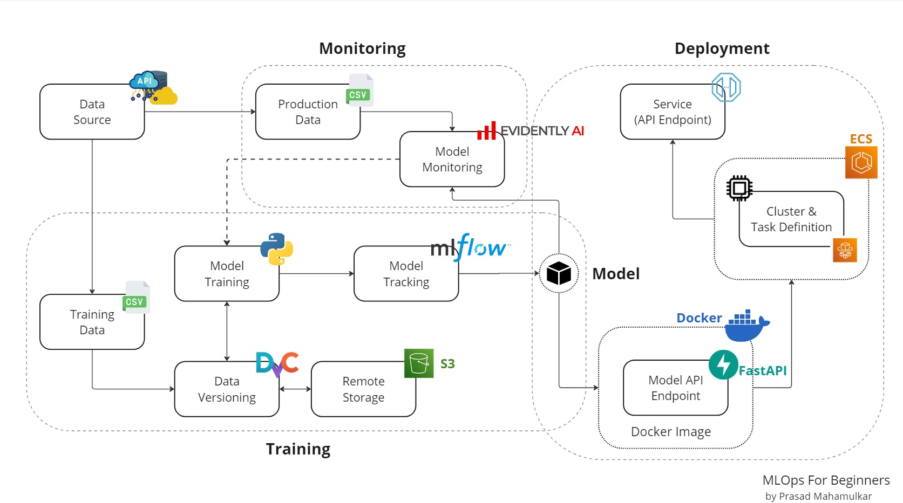

# 🏠 Insurance Cross-Sell Prediction

<p align="center">
  
  
  
  
  
</p>

<p align="center">
  An End-to-End MLOps Project for predicting customers likely to purchase additional insurance products.
</p>

---

## 📌 Overview

Insurance companies often seek opportunities to cross-sell products to existing customers. This project leverages Machine Learning and MLOps best practices to identify customers who are most likely to purchase additional insurance coverage.

The project demonstrates a complete production-ready ML workflow including:

* Data Versioning with DVC
* Data Ingestion & Validation
* Feature Engineering
* Model Training & Evaluation
* Experiment Tracking
* FastAPI Deployment
* Docker Containerization
* CI/CD Ready Structure
* Model Monitoring with Evidently AI

---

## 🏗️ Project Architecture

<p align="center">
  
</p>

### Workflow

```text
Data Source
    │
    ▼
Data Ingestion
    │
    ▼
Data Validation
    │
    ▼
Data Transformation
    │
    ▼
Model Training
    │
    ▼
Model Evaluation
    │
    ▼
Model Deployment (FastAPI)
    │
    ▼
Docker Container
    │
    ▼
Monitoring & Drift Detection
```

## 🚀 Tech Stack

| Category         | Tools               |
| ---------------- | ------------------- |
| Programming      | Python              |
| ML Framework     | Scikit-Learn        |
| API Framework    | FastAPI             |
| Data Versioning  | DVC                 |
| Containerization | Docker              |
| Monitoring       | Evidently AI        |
| Version Control  | Git & GitHub        |
| CI/CD            | GitHub Actions      |
| Environment      | Virtual Environment |

---

## 📂 Project Structure

```bash
Insurance-Cross-Sell-Prediction/
│
├── artifacts/
├── config/
├── data/
├── docs/
├── logs/
├── models/
├── notebooks/
├── src/
│
├── app.py
├── main.py
├── requirements.txt
├── Dockerfile
├── dvc.yaml
├── params.yaml
├── setup.py
└── README.md
```

---

## ⚙️ Installation

### Clone Repository

```bash
git clone https://github.com/HM-Sagar/mlops-project.git
cd mlops-project
```

### Create Virtual Environment

#### Linux / Mac

```bash
python -m venv venv
source venv/bin/activate
```

#### Windows

```powershell
python -m venv venv
venv\Scripts\activate
```

### Install Dependencies

```bash
pip install -r requirements.txt
```

Or

```bash
make setup
```

---

## 📊 Data Version Control (DVC)

Pull the dataset using DVC:

```bash
dvc pull
```

If DVC is unavailable, the train and test datasets are already included in the `data/` directory.

---

## 🧠 Model Training

Train the machine learning model:

```bash
python main.py
```

Or

```bash
make run
```

The pipeline will:

* Load the dataset
* Perform preprocessing
* Train the model
* Evaluate performance
* Save artifacts and model files

---

## 🌐 FastAPI Deployment

Start the API server:

```bash
uvicorn app:app --reload
```

Access:

```text
http://127.0.0.1:8000
```

Swagger Documentation:

```text
http://127.0.0.1:8000/docs
```

---

## 🐳 Docker Deployment

### Build Docker Image

```bash
docker build -t insurance-cross-sell .
```

### Run Container

```bash
docker run -p 80:80 insurance-cross-sell
```

Application URL:

```text
http://localhost
```

---

## 📈 Model Monitoring

Monitor model performance and data drift using Evidently AI.

```bash
Run monitor.ipynb
```

Monitoring includes:

* Data Drift Detection
* Target Drift Analysis
* Feature Distribution Monitoring
* Model Performance Tracking

---

## 🔍 Features

✅ End-to-End MLOps Pipeline

✅ Data Versioning with DVC

✅ Automated Training Pipeline

✅ FastAPI Deployment

✅ Dockerized Application

✅ Modular Code Structure

✅ Model Monitoring

✅ Production Ready

---

## 📊 Future Enhancements

* MLflow Experiment Tracking
* Kubernetes Deployment
* GitHub Actions CI/CD
* AWS/Azure Deployment
* Prometheus & Grafana Monitoring
* Automated Retraining Pipeline

---

## 👨‍💻 Author

### H M Sagar

**DevOps & MLOps Engineer**

* Cloud Infrastructure
* Kubernetes
* CI/CD Automation
* Machine Learning Operations
* Azure & Docker Ecosystem

GitHub: https://github.com/HM-Sagar

LinkedIn: https://linkedin.com/in/hm-sagar

Email: [sagarhm2701@gmail.com](mailto:sagarhm2701@gmail.com)

---

## 📜 License

Licensed under the Apache 2.0 License.

Copyright © 2026 H M Sagar
